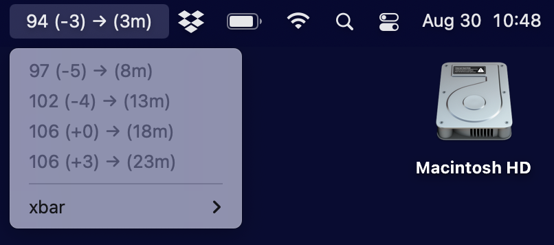

## Dexcom menubar

This Python script is a plugin for [xbar](https://xbarapp.com/) that allows you to pull recent blood glucose values from [Dexcom Share](https://www.dexcom.com/training-videos/setting-up-dexcom-share-and-follow) and display them in the Mac menubar:

The design is based heavily on the [Nightscout](https://github.com/nightscout/cgm-remote-monitor#nightscout-web-monitor-aka-cgm-remote-monitor)-based menubar apps by [Mark Wilson](https://github.com/mddub/nightscout-osx-menubar) and [Michael Pangburn](https://github.com/mpangburn/NightscoutMenuBar). 

By default,the script runs once per minute to update the displayed age of the BG values, but tries to minimize network requests by only downloading new BGs if the most recent reading is more than four minutes old. Current values are cached in a text file in `/tmp`. 

### Prerequisites:

* A working Python 3 installation.  While Python is no longer included by default with the Mac OS, you can install it from the Xcode command-line tools, [homebrew](https://brew.sh/), or [Anaconda](https://www.anaconda.com/).
* The [pydexcom](https://github.com/gagebenne/pydexcom) package.  Install it with `pip install pydexcom`. 
* A working Dexcom Share setup that is uploading your blood glucose values (or those of someone who has given you access to their data) to the cloud. 

### To install: 

I hope to submit this to the repository of xbar plugins, but until then: 

* Copy the [Dexcom_BG.1m.py](Dexcom_BG.1m.py) script to `~/Library/Application Support/xbar/plugins/`.
* Make the script executable by running in the Terminal: `chmod +x ~/Library/Application\ Support/xbar/plugins/BG.1m.py`
* Set your Dexcom Share username and password via accessing the plugin in the xbar interface, or by editing the script directly and changing `VAR_USERNAME` and `VAR_PASSWORD`.  Be aware that your username and password will be stored on your computer in plain text, so there is a potential security risk of running this on a computer that others have access to. 
* Optionally, set `VAR_OUTSIDE_US` to "True" if you are not in the United States. 
* Launch xbar, and if you wish, set it to launch auomatically at login. 

### Troubleshooting: 

The output of the script is simply text, and xbar handles putting that into the menu bar.  If things don't seem to be running properly, see if you can run the script in the Terminal.  You should see some text output to the screen. 

If xbar is running but you don't see anything in the menubar, see the issue below. 

### Known issues: 

* On M1 MacBooks (with a "notch" for the camera in the menubar area), xbar may place the menubar output in the invisible notch region.  This is general xbar issue that affects all plugins.  If you start this plugin but don't see any output, try quitting xbar, removing other icons from the menu bar and re-launching xbar.  You can then re-add your other icons, which hopefully are notch-aware and will move accordingly. 

Enjoy! If you have any questions or problems, please open an issue here. 

